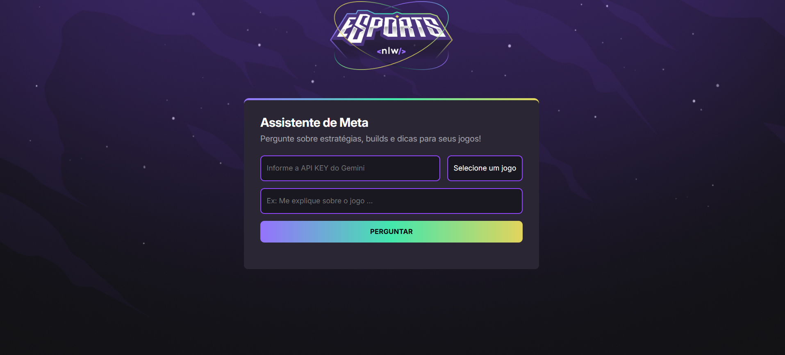

# 🕹️ Assistente de IA para Gamers - NLW eSports (Missão Iniciante)

Esse projeto é o clássico NLW eSports da Rocketseat, mas com um toque especial: construímos um **Assistente de IA usando a API do Gemini** para ser o cérebro do nosso projeto. Ele se conecta diretamente à API Gemini da Google para fornecer respostas inteligentes ao usuário.  
Um app **100% frontend**, desenvolvido com HTML, CSS e JavaScript, com design moderno, animações e o mais importante: que te ajuda em tempo real nos jogos, dando dicas de estratégia, callouts, informações e sugestões para melhorar a gameplay.
Atualmente desenvolvido para atender informações sobre esses jogos: **Hollow Knight, Dak Souls 3 e Resident Evil 2.**

---

## 🚀 O que tem aqui?

✅ Projeto base do NLW eSports (100% frontend)  
✅ Frontend bonito e fluido, com animações clássicas que deixam o app vivo
✅ Integração com a API do Gemini (Google) para ser o cérebro do assistente  
✅ Assistente que entende o contexto do jogo e manda dicas em tempo real  
✅ Código limpo e comentado (quem possui o repositório entende facilmente)

---

## 🛠️ Stack usada

- **Frontend:** HTML, CSS e JavaScript (criativo e completo).
- **IA:** Gemini API (Google) para processar tudo.

---

## 📸 Screenshots

<p align="center">
  
</p>

---

## 🚧 Como rodar o projeto

Clone o repositório:

```bash
git clone https://github.com/BiaMoraes97/Projeto-NLW-Agents.git
```

Entre na pasta do projeto:

```bash
cd Projeto-NLW-Agents
```

Crie uma conta no Google Cloud Console, ative a API Gemini e gere sua própria chave de API.

Abra o arquivo index.html no navegador (pode dar dois cliques ou usar a extensão "Live Server" no VSCode).

Cole sua chave no campo "API Key" da interface da página.

Pronto! Agora é só começar a usar a aplicação.

⚠️ Importante: sua chave fica salva localmente no seu navegador (via localStorage).
**Nunca compartilhe essa chave com outras pessoas!**
